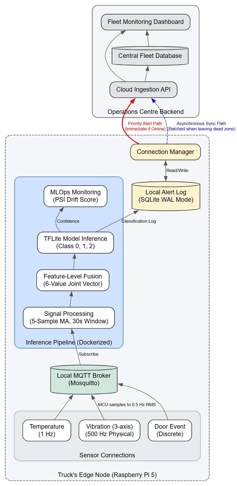

# LogiEdge: Edge AI Cold-Chain Telemetry & Real-Time Drift Monitoring

LogiEdge is an Edge IoT pipeline engineered for real-time anomaly detection and Population Stability Index (PSI) drift monitoring in cold-chain logistics. Built for resource-constrained ARM architectures (Raspberry Pi 5 and NVIDIA Jetson Xavier NX), the system detects refrigeration failures, compressor degradation, and distribution drift locally without cloud dependencies.



---

## Technical Specifications & System Highlights

| Component | Implementation Detail | Architectural Significance |
| :--- | :--- | :--- |
| **Inference Engine** | TensorFlow Lite (Pruned + INT8 Quantized) | ~75% model footprint reduction; sub-millisecond execution on ARM CPUs |
| **Model Architecture** | 6-input MLP: `Dense(32) -> Dense(16) -> Dense(3 softmax)` | The trained classifier ingests the fused 6-feature window and emits a discrete anomaly decision across three classes |
| **Output Semantics** | `0 = Normal`, `1 = Warning`, `2 = Critical` | Explicit fault-mode labeling for reliable operational interpretation and alerting |
| **Messaging Bus** | Eclipse Mosquitto (MQTT) | Asynchronous, decoupled microservices across telemetry, inference, and monitoring |
| **Telemetry Ingestion** | Multi-Rate Fusion (1 Hz Temp / 500 Hz Vibration) | Time-scaled sliding windows compute statistical features (RMS, Peak, Kurtosis) |
| **Drift Monitoring** | Population Stability Index (PSI) Watchdog | Continuous baseline-distribution comparison across rolling inference windows |
| **Orchestration** | Linux `systemd` Daemons via Ansible | Process isolation, automated recovery, and zero-touch cross-platform deployment |

---

## Core Architectural Principles & Engineering Insights

### 1. Static vs. Dynamic Normalization Baselines
- **The Insight:** Normalization statistics (mean and standard deviation) are locked to the training baseline and never recomputed from live telemetry.
- **Why it Matters:** Dynamically recalibrating statistics on live edge streams causes the normalization layer to adapt to corrupted or drifting data, mathematically masking gradual sensor degradation. Keeping reference distributions static guarantees that real-world thermal drift remains detectable via PSI.

### 2. Multi-Rate Sensor Synchronization
- **The Insight:** Sensor streams with asymmetric sampling rates (1 Hz thermal vs. 500 Hz vibration) are synchronized using wall-clock duration offsets (`step_seconds * sample_rate_hz`), rather than unified array index steps.
- **Why it Matters:** Decoupling raw index stepping prevents temporal misalignment, ensuring 30-second feature windows capture concurrent physical events across thermal and mechanical domains.

### 3. Tiered MQTT Quality of Service (QoS)
- **The Insight:** Quality of Service is allocated according to data velocity and downstream impact.
- **Why it Matters:** The 500 Hz vibration stream publishes under **QoS 0** to eliminate per-message broker acknowledgment overhead, as downstream feature aggregations (RMS, kurtosis) naturally absorb minor frame drops. Critical alerts, state transitions, and inference outputs utilize **QoS 1** to guarantee delivery without broker congestion.

### 4. Model Output Contract
- **The Model Type:** This is a supervised 3-class softmax classifier, not an autoencoder or unsupervised anomaly detector.
- **Input Contract:** The model consumes a fused 6-feature vector derived from the 30-second synchronized telemetry window.
- **Output Classes:** `0 = Normal`, `1 = Warning`, `2 = Critical`.
- **Drift Monitoring:** The PSI watchdog then evaluates the confidence distribution of the `Normal` class over rolling windows to detect gradual distributional drift beyond nominal bounds.

---

## Repository Structure

```text
LogiEdge/
├── data_pipeline/           # Sensor simulation, feature extraction, and MQTT integration
├── inference/               # TFLite inference microservice and quantized model artifacts
├── monitoring/              # Real-time PSI drift monitoring and alerting service
├── deployment/              # Ansible automation playbooks and systemd service manifests
├── optimization/            # Model quantization benchmarks, pruning scripts, and profiles
├── docs/                    # Architecture diagrams and technical reference documentation
├── mkdocs.yml               # Documentation site configuration
└── requirements.txt         # Pinned Python dependencies
```

---

## Supported Environments

- **Raspberry Pi 5 (ARM Cortex-A76)** — Verified via Ansible playbook and isolated microservices.
- **NVIDIA Jetson Xavier NX (Ubuntu 20.04)** — Verified via Ansible playbook and containerized services.
- **PC / WSL2** — Verified for simulation and local model evaluation.

---

## Documentation (Docs-as-Code)

The repository includes a complete docs-as-code technical site built with MkDocs. To preview architecture decisions, mathematical formulations, and benchmarking reports locally:

```bash
# Activate your virtual environment and install project dependencies
source venv/bin/activate
pip install --upgrade pip
pip install -r requirements.txt

# Start the local documentation server
mkdocs serve
```

Once running, navigate to `http://127.0.0.1:8000` in your browser.

- [Architecture & System Design](docs/index.md)
- [Hardware Benchmarks & Analysis](docs/assignment/README.md)

---

## Deployment & Execution Guide

### Step 1: Install System Dependencies & MQTT Broker
Update the target device and install Mosquitto, Ansible, Git, and Python build utilities:

```bash
sudo apt update && sudo apt upgrade -y
sudo apt install mosquitto mosquitto-clients ansible git python3-pip python3-venv -y
sudo systemctl enable --now mosquitto
```

### Step 2: Clone the Repository
```bash
cd ~
git clone https://github.com/Srini235/LogiEdge.git
cd LogiEdge
# Optional: if the remote URL differs from your repo settings
# git remote set-url origin https://github.com/<your-user>/<your-repo>.git
```

### Step 3: Configure Virtual Environment & Dependencies
```bash
python3 -m venv venv
source venv/bin/activate
pip install --upgrade pip
pip install -r requirements.txt
```

### Step 4: Deploy Background Services via Ansible
Automate systemd daemon registration and configuration using the deployment playbook:

```bash
cd deployment
ansible-playbook logiedge_deploy.yml -i localhost, -c local --ask-become-pass
```

Verify service status:
```bash
sudo systemctl status logiedge-preprocessor.service
sudo systemctl status logiedge-monitor.service
```

### Step 5: Live Pipeline Validation

#### Terminal 1: Stream Drift Monitor Logs
```bash
sudo journalctl -u logiedge-monitor.service -f
```

#### Terminal 2: Inject Simulated Telemetry
```bash
cd ~/LogiEdge/data_pipeline
source ../venv/bin/activate

# 1. Nominal telemetry stream (Healthy baseline, PSI ≈ 0.00)
python3 simulator.py --anomaly none

# 2. Inject thermal drift anomaly (Observe PSI threshold breach > 0.25)
python3 simulator.py --anomaly temp_drift
```

---

## Architecture Trade-offs & Production Roadmap

- **Hardware I/O Abstraction:** Telemetry is currently ingested via simulated IPC. **Next Phase:** Introduce a Hardware Abstraction Layer (HAL) for physical sensor integration over industrial buses (**protocols like I2C, SPI, and RS-485 / Modbus RTU**).
- **Configuration Management:** Service paths and MQTT topics are currently managed via static definitions for deployment predictability. **Next Phase:** Externalize all topics, thresholds, and window sizes into a centralized `config.yaml` with dynamic Jinja2 templating (`.service.j2`) in Ansible.
- **Closed-Loop Edge MLOps:** Out-of-distribution drift alerts currently log to local daemons. **Next Phase:** Integrate an edge-to-cloud telemetry sync agent to upload flagged data windows for cloud retraining and automated, seamless Over-the-Air (**OTA**) model weight distribution.
- **Security Hardening:** Production deployment requires authenticated MQTT access, TLS/mTLS for edge-to-cloud communication, encrypted persistence, and secret management for device credentials and model artifacts.
- **Operational Observability:** Add structured logging, centralized metrics, health probes, and alert dashboards to monitor edge service health, message loss, inference latency, and sensor degradation in fleet deployments.
- **Reliability & Fault Tolerance:** Introduce retry/backoff policies, watchdog restarts, dead-letter queues, and graceful degradation to maintain safety under network outages or device faults.
- **CI/CD & Validation Pipeline:** Add automated unit, integration, and hardware-in-the-loop tests, plus rollout gates for model versioning, smoke tests, and rollback procedures before production deployment.
- **Fleet-Scale Governance:** Extend the current single-truck prototype to multi-vehicle fleet management with per-device identity, fleet-level monitoring, synchronized OTA strategies, and central operations dashboards.
- **Real-World Validation:** Benchmark against live cold-chain telemetry, test under temperature excursions and vibration stress, and validate model robustness over long-duration deployments on Raspberry Pi and Jetson targets.